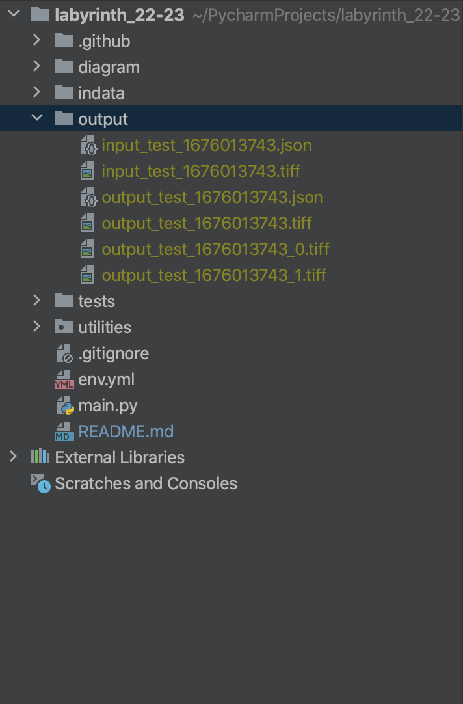
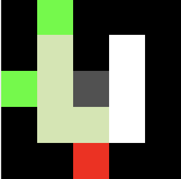
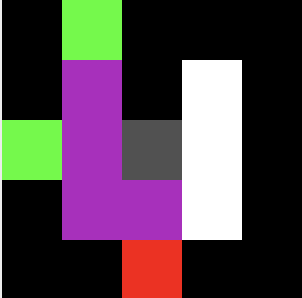

# Labyrinth

Final examination of the course of Programmazione, accademic year 2022/2023.

This project was developed by (Alphabetical order):

- Calandra Vincenzo Maria
- Fiorio Federico
- Papa Eleonora

under the supervision of Professor Iannello Giulio.

## How to install the environment?
First of all you must have conda as python package manager, you can find it [here](https://docs.conda.io/en/latest/miniconda.html).
After you have installed and configured it, you have to run the following command.

```console
foo@bar:~$ conda env create -f env.yml
```

After that you can activate your conda env.

```console
foo@bar:~$ conda activate maze
```

## How it works
For use this code us implemention 2 type of input data on system.
The principal use of this code is when you decide to run with Argparse Menu.

If the user try to run the main.py the system respone:
```console
Welcome to Maze.py!
```

## Information for User
When you strat with code and running it's fondamental for a correct use.
The breacrumps accept just a combination of number.

When you use the interface or write a file json say that.
   on json when you write on "Costi" the parameter is between from 1 to 15
   same on you decide running with interface

If you put image this point named on code breadcrumps rispect this scale of grey

- 16 assigning a cost of 1
- 32 assigning a cost of 2
- 48 assigning a cost of 3
- 64 assigning a cost of 4
- 80 assigning a cost of 5
- 96 assigning a cost of 6
- 112 assigning a cost of 7
- 128 assigning a cost of 8
- 144 assigning a cost of 9
- 160 assigning a cost of 10
- 176 assigning a cost of 11
- 192 assigning a cost of 12
- 208 assigning a cost of 13
- 224 assigning a cost of 14
- 240 assigning a cost of 15

And for this yuo have for example this option for running the code:
```console
#This implementetion response with the menu the possible choice is write on down
python main.py -it
```
Go to the principal folder and launch the code main.py. In the terminal you will have 3 options, choose the one you prefer:
1. Create Maze
    - For example:
    - Enter your choice: 1
    - Insert the height of the maze: 10
    - Insert the width of the maze: 10
    - Insert the start point as a list: 10 2
    - Do you want to add another start point? (yes/no): no 
    - Insert the goal point as a list: 8 4
    - Do you want to add breadcrumps? (yes/no): yes
    - Insert the breadcrump (x y weight): 2 2 1
    - Do you want to add another breadcrump? (yes/no): yes
    - Insert the breadcrump (x y weight): 4 3 5
    - Do you want to add another breadcrump? (yes/no): yes
    - Insert the breadcrump (x y weight): 3 5 2
    - Do you want to add another breadcrump? (yes/no): no
   
2. Upload image 
    - For example:
    - Enter your choice: 2
    - Enter the path of the image on tiff: ./img_input/30-20_marked.tiff
3. Upload JSON
    - For example:
    - Enter your choice: 3
    - Enter the path of the json file: ./indata/20-10_marked.json
4. Exit

Another one possible running code:
```console
#This implementetion response with the menu the possible choice is write on down
python main.py -g -he 10 -w 10 -sp 1 5 -ep 5 7 -bc 3 3 126
```
These command run code with a generated maze

Alternative one possible running code:
```console
#This implementetion response with the menu the possible choice is write on down
python main.py -tf writePathofTiffThere
```
These command run code when operator put path maze on tiff format

Alternative one possible running code:
```console
#This implementetion response with the menu the possible choice is write on down
python main.py -jp writePathofJsonThere
```
These command run code when operator put path maze on json format

* If you choose to create the maze, remember to stay in the borders when assigning variables
***
## Example of a json file for a maze
```json
{
    "larghezza": 5,
    "altezza": 5,
    "pareti": [
        {
            "orientamento": "H",
            "posizione": [
                0,
                2
            ],
            "lunghezza": 3
        },
        {
            "orientamento": "H",
            "posizione": [
                4,
                0
            ],
            "lunghezza": 2
        },
        {
            "orientamento": "H",
            "posizione": [
                4,
                3
            ],
            "lunghezza": 2
        },
        {
            "orientamento": "v",
            "posizione": [
                0,
                0
            ],
            "lunghezza": 2
        },
        {
            "orientamento": "v",
            "posizione": [
                3,
                0
            ],
            "lunghezza": 2
        },
        {
            "orientamento": "v",
            "posizione": [
                0,
                2
            ],
            "lunghezza": 2
        },
        {
            "orientamento": "v",
            "posizione": [
                0,
                4
            ],
            "lunghezza": 5
        }
    ],
    "iniziali": [
        [
            2,
            0
        ],
        [
            0,
            1
        ]
    ],
    "finale": [
        [
            4,
            2
        ]
    ],
    "costi": [
        [
            2,
            2,
            12
        ]
    ]
}
```

***

# Output
Software implement the function archive all output data on folder name "Output".
For every file input in the folder founded minimum 4 file 2 for input and minimum 2 output
Software genereted or copy input file and rename this.
After the function FoundPath, code generate and write a Json Output File.
The last part of generation is the part create a different image.
Software created 1 images with together path on maze and one image for a single path.

## Image of Output
Now is possible see a tree of file created in folder
The file our try is the example on top file is: a Json Input and save this with test.json

Our code create 5 file:
 - The firstone image are clean there is just a strat point end point and breadcrumps
 - The output is minimun with one file but if there is a multi start generate one with all path and one for a single path
   - The example in this test have 2 start point for these the code create 3 Output Image
     - One name with all path found
     - One for a single path start from one point and arrive on goal this created in 2 version .tiff and .gif

### Show a simple output










## Json of Output
```json
[
    {
        "PercorsoDa(2, 0)": {
            "Opzione1": {
                "start": [
                    2,
                    0
                ],
                "goal": [
                    4,
                    2
                ],
                "path": "ESES",
                "numberOfMoviment": 4,
                "cost": 4,
                "movimentPath": [
                    [
                        2,
                        1
                    ],
                    [
                        3,
                        1
                    ],
                    [
                        3,
                        2
                    ],
                    [
                        4,
                        2
                    ]
                ]
            },
            "Opzione2": "NO WAY!",
            "Opzione3": "NO WAY!"
        }
    },
    {
        "PercorsoDa(0, 1)": {
            "Opzione1": {
                "start": [
                    0,
                    1
                ],
                "goal": [
                    4,
                    2
                ],
                "path": "SSSES",
                "numberOfMoviment": 5,
                "cost": 5,
                "movimentPath": [
                    [
                        1,
                        1
                    ],
                    [
                        2,
                        1
                    ],
                    [
                        3,
                        1
                    ],
                    [
                        3,
                        2
                    ],
                    [
                        4,
                        2
                    ]
                ]
            },
            "Opzione2": "NO WAY!",
            "Opzione3": "NO WAY!"
        }
    }
]
```

Is possible wiev in this output there are for all point of start 3 option of path if don't found the path
code return "NO WAY!"

---

## Dockerized Application
It also has been developed a containerized version of the application. To use it you should have a docker as container engine.

To run the docker container you have 2 option:
```console
# First build the image 
foo@bar:~$ docker build -t maze .
#Use directly docker-cli and execute the following command
#Where $PWD is the abs path to the folder
foo@bar:~$ docker run -v $PWD/indata:/usr/src/app/indata -v $PWD/output:/usr/src/app/output maze
```
or
```console
#Use docker-compose plugin and execute the following command
foo@bar:~$ docker-compose up
```
If you choose to run the dockerized version of the application it will works as follow:
- If you put a valid .tiff or a .json file in the "indata" dir the file will be read and the file will be deleted.
- In the output dir will appears the generated output of the readed maze.
  
## How to run unittest
To run unittest you can execute the TestMaze.py under test directory to run all test like:
```console
foo@bar:~$ python TestMaze.py
```
Or you can run directly the module you want to test, if the module contains a main with doctest import, with the following command:
```python
# maze.py

# ...

if __name__ == "__main__":
    import doctest
    doctest.testmod()
```

<br>

```console
foo@bar:~$ python maze.py -v
```

Or if the module doesnt contains the doctest import:

```console
foo@bar:~$ python -m doctest maze.py -v
```

___


## Some useful information
Here you can find a diagram that graph possible functionalities of this tool.

