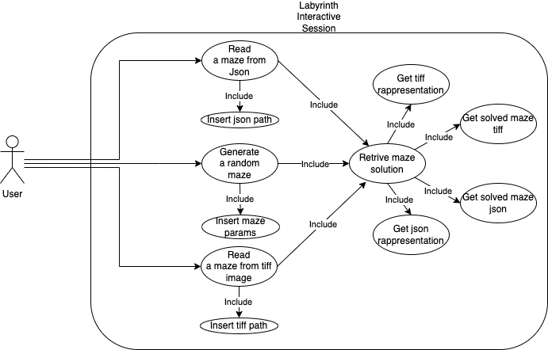

# Labyrinth

Final examination of the course of Programmazione, accademic year 2022/2023.

This project was developed by (Alphabetical order):

- Calandra Vincenzo Maria
- Fiorio Federico
- Papa Eleonora

under the supervision of Professor Iannello Giulio.

## How to install the environment?
First of all you must have conda as python package manager, you can find it [here](https://docs.conda.io/en/latest/miniconda.html).
After you have installed and configured it, you have to run the following command.

```console
foo@bar:~$ conda env create -f env.yml
```

After that you can activate your conda env.

```console
foo@bar:~$ conda activate maze
```

## How it works
Go to the principal folder and launch the code main.py. In the terminal you will have 3 options, choose the one you prefer:
1. Create Maze
2. Upload image
3. Upload JSON
Note, consider the three implementation methods before you run your code.
* If you choose to create the maze, remember to stay in the borders when assigning variables
* If you choose to create a maze from an image make sure to insert the image in the "img_input" folder because the program will draw the maze on the last inserted image

## How to run unittest
To run unittest you can execute the TestMaze.py under test directory to run all test like:
```console
foo@bar:~$ python TestMaze.py
```
Or you can run directly the module you want to test, if the module contains a main with doctest import, with the following command:
```python
# maze.py

# ...

if __name__ == "__main__":
    import doctest
    doctest.testmod()
```

<br>

```console
foo@bar:~$ python maze.py -v
```

Or if the module doesnt contains the doctest import:

```console
foo@bar:~$ python -m doctest maze.py -v
```
## Some useful information
Here you can find a diagram that graph possible functionalities of this tool.

